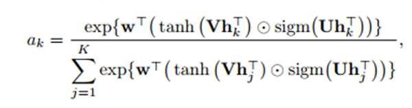
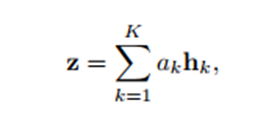

# This challenge could be addressed by: 
## Classification
### Multi-class in image level, based on binary classification in atomic granularity of tile-level. Challenge - no real object to classify but rather the notion of sharp edges or good/bad tile.
### MIL (Multiple Instance learning) – there is certain evidence for one of the classes among the tiles (instances/tiles in a bucket/image). Based on embeddings out of a backbone, employ the Gated Attention approach by Max-wellington
## Ordinal regression 
## Anomaly tile detection – by contrastive based => noisy labels are major shortcomings 

Asses/classify the image quality by learning what is the concept of bad/marginal/good quality. 
There is no real object to classify but rather patterns/semantics which manifest the quality

[2017 RankIQA Learning from Rankings for No-reference Image Quality Assessment[92]] Similarity matching – by pairs of created deteriorated quality pair
IQA approaches are generally divided into three categories based on whether the undistorted image (called reference image) or information about it is available: full-reference IQA (FR-IQA), reduced-reference IQA (RRIQA), and no-reference IQA (NR-IQA). Research has
mostly focused on the more realist scenario of NR-IQA
where the image quality of an image without any reference
image has to be estimated. In NR-IQA, many methods focus on a specific distortion [38, 7], which limits the applicability of these methods. Other methods consider a range
of distortions [20, 23, 18, 19].

[2017 On the Use of Deep Learning for Blind Image Quality[126].pdf] – 
They benchmarked vs. LCC (lin-corr ) between their regressed score to MOS one by 0.91(LIVE In the Wild Image Quality Challenge)
DeepBIQ, estimates the image quality by average-pooling the scores predicted on multiple sub-regions (tiles) of the original image.
Quality = Ranking challenge  : Definition : image quality assessment (IQA) algorithm, given an input image, tries to predict its perceptual quality. The perceptual quality of an image is usually defined as the mean of the individual ratings of perceived quality assigned by human subjects (Mean Opinion Score - MOS).
NR-IQA algorithms assume that image quality can be determined without a direct comparison between the original and the image under test. NR-IQA algorithms can be further classified into two main sub-groups:
1.	To the first group belong those targeted to estimate the presence of a specific image artifact (i.e. blur, blocking, grain, etc.) [6,8]; 
2.	to the second group the ones that estimate the overall image quality and thus are distortion
generic [33,40,5,7]. In this work we focus on distortion generic NR-IQA.

-	The use of a database of images along with their subjective scores is fundamental for both the design and
the evaluation of IQA algorithms [41,14].
-	Fine-tuning the CNN to classify image crops into five distortion classes (i.e. bad, poor, fair, good, and excellent)

Kottayil et al. [21] used a hybrid approach composed by a shallow CNN architecture followed by a regressor to refine the quality score prediction 
DeepBIQ outperforms the state-of the-art methods compared, having a Linear Correlation
Coefficient (LCC) with human subjective scores of almost 0.91. These results are further confirmed also on
four benchmark databases of synthetically distorted images: LIVE, CSIQ, TID2008 and TID2013
Most of the distortion-generic methods estimate the image quality by measuring deviations from Natural
Scene Statistic (NSS) models [5] that capture the statistical \naturalness" of non-distorted images. The Natu
The hypothesis motivating our research is that the presence of image distortion such as JPEG compression, noise, blur, etc. is captured and modelled by these features as well

## Late fusion:
### Hard fusion : voting of tile’s final class
### Soft fusion  : avg pooling of tiles embeddings
### Weighted soft fusion (Attention) : more generalized, inside the NN + pos_embeddings
Challenge: In image level, data is sparser than in tile level 6K vs. 130K

Training 
Based on MobileNetV2 transfer learning/full training    
Binary classifier per tile of 256**2 : fusion made outside the net 

python -u ./dev/quality_bin_cls_cnn.py mobilenet_v2_2FC_w256_nlyrs --tensorboard-log-dir /hdd/hanoch/runmodels/img_quality/results/mobilenet_v2_256_win_n_lyrs/canny_edges_sum_50_70 --database-root /hdd/hanoch/data/lice-data-bbox-20191106-simple-sharded-part/tile_data --dataset-split-csv /hdd/hanoch/data/lice-data-bbox-20191106-simple-sharded-part/tile_data/file_quality_tile_eileen_good_bad_val_bad_9_20_avg_pool_filt_conf_filt_no_edges_trn_tst_fitjar_ntiles.csv --result-dir /hdd/hanoch/runmodels/img_quality/results/mobilenet_v2_256_win_n_lyrs/canny_edges_sum_50_70 --nlayers-finetune 22 --hsv-hue-jitter 0.1 --hsv-sat-jitter 0.2 --gradient-clip-value 5 --batch-size 32 --epochs 20 --lr 0.0001 --lr-decay-base 0.7 --dropout 0.2 --balancing-sampling  --handcrafted-features n_tiles --gpu-id 3

fusion 
Average pooling of the softmax score outside the NN
Voiting using final classification
Attention:
Max welling : Gated attention (MIL)
MIL - Like in Self-Attention : V, U are linear projection from the backbone embeddings as an input : embeddings dim MV2 embeddings_dim=1280 and attention_dim=128.

Transformer encoder inspired by VIT 

Approach:
At first not too much data : transfer learning =>early overfitting was observed 
Later : diversified data : full training 
Tile based training: 
Batch balancing
AdamW : Lr : warmup + decay=0.8 @ each 4 epochs
Augmentation  : color (H/S) jitter + flip-H/V
TTA  : +1%
Loss : CE w/ loss smooth
Gradient clipping <= 5
Regularization:
Early stopping /Weight decay=1e-3 / dropout=0.5 / smooth loss=0.1 (compete overconfident + noisy labels) and drop-block (no gain back than)
Performance were tested against a holdout-set along with a test-set
HCF of N_tiles isn’t discriminative with marginal images , Monte-Carlo dropout to assess uncertainty for OOD detection, GradCam for XAI
Similarity training : Contrastive/triplet  loss, t-SNE analysis shows non separable classes  - WIP
Fusion in the NN:
Gated attention (MIL) : Max welling : permutation invariant => w/ positional embeddings
Transformer encoders with self attention + 1D/2D positional embedding  inspired by visual-VIT of Google
